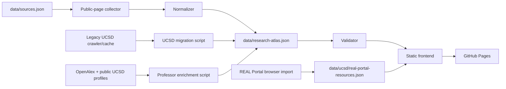

# Architecture

Research Atlas is designed as a static data product: collection happens ahead of time, the result is committed as JSON, and GitHub Pages serves the finished search experience with no backend.



## Static Frontend

Files:

- `index.html`: semantic shell, search controls, filters, results, details drawer.
- `assets/styles.css`: responsive visual system for desktop and mobile.
- `assets/app.js`: client-side indexing, searching, filtering, saved records, REAL Portal resource loading, details view.

The browser loads `data/research-atlas.json` and `data/ucsd/real-portal-resources.json`, merges professors, labs, and REAL Portal resources into one searchable index, and filters entirely client-side. This keeps hosting simple and makes GitHub Pages deployment immediate.

## Canonical Dataset

The canonical file is `data/research-atlas.json`.

The current UCSD build migrates the full legacy index into this file: 4,304 professor records and 435 stricter lab records.

Professor records include:

- `name`
- `institution`
- `department`
- `officialProfileUrl`
- `personalWebsiteUrl`
- `email`
- `researchAreas`
- `researchSummary`
- `googleScholarUrl`
- `googleScholarSearchUrl`
- `linkedinSearchUrl`
- `academicProfile` with OpenAlex citation counts, h-index, works count, recent publications, and source links
- `labAffiliation`
- `labAffiliationUrl`
- `recruitingStatus`
- `recruitingEvidence`
- `sourceUrls`
- `lastVerified`

Lab records include:

- `labName`
- `institution`
- `department`
- `labWebsiteUrl`
- `principalInvestigator`
- `principalInvestigatorProfileUrl`
- `researchAreas`
- `description`
- `contactEmail`
- `recruitingStatus`
- `recruitingEvidence`
- `sourceUrls`
- `lastVerified`

UCSD migrated lab records may also include `recordSubtype`, currently `lab`.

REAL Portal resources are kept in `data/ucsd/real-portal-resources.json` because they come from a separate browser-rendered public portal. They are presented as a third record type in the frontend rather than mixed into `labs[]`.

Broad research-topic pages, academic-support pages, research facilities/resources pages, clubs, FAQ pages, publication pages, project pages, and department directory pages are not lab records. They can remain in `sourceUrls` when they support discovery, but the published lab list should point to actual lab, laboratory, or PI-linked research-group pages.

Missing fields should be written as `Not found` or `Unknown`. Recruiting is never inferred from general lab activity; it requires explicit public language and evidence.

## Data Collection

`scripts/collect_research_data.py` reads `data/sources.json`.

The collector:

- fetches only public HTTP(S) pages;
- respects `robots.txt` by default;
- follows shallow faculty, profile, lab, research group, and center links;
- optionally enriches the first page of discovered personal websites with a bounded `--personal-limit`;
- extracts emails, profile links, Scholar links, personal websites, lab links, research keywords, and short summaries;
- detects explicit recruiting or not-recruiting phrases;
- writes records in the canonical schema.

It is intentionally conservative. Generic HTML is messy, and the script should prefer `Unknown` over unsupported claims. For high-quality production data, add school-specific adapters around this schema.

## Validation

`scripts/validate_data.py` enforces:

- non-empty professor/lab arrays;
- required fields for each record type;
- at least one source URL per record;
- valid URL/email shape or accepted missing markers;
- explicit evidence text and evidence URL for `Recruiting` or `Not recruiting`;
- collection policy requiring explicit recruiting evidence.

## Legacy UCSD Assets

The previous project generated `data/ucsd/research-index.json` with `scripts/build_ucsd_index.py`. Those files are kept so existing UCSD work is not lost, but the new frontend uses `data/research-atlas.json`.

To keep full UCSD coverage:

```bash
python3 scripts/build_ucsd_index.py
python3 scripts/migrate_ucsd_index.py --input data/ucsd/research-index.json --out data/research-atlas.json
python3 scripts/validate_data.py
python3 scripts/audit_research_atlas.py
```

Good migration path:

1. Keep legacy crawler output for broad discovery.
2. Convert reviewed records into the canonical professor/lab schema with `scripts/migrate_ucsd_index.py`.
3. Use `sourceUrls` and `recruitingEvidence` to preserve provenance.
4. Validate before publishing.

## Deployment

The repo can be deployed in either Pages mode:

- Branch/root Pages deployment, because `index.html` is at the repo root.
- Actions deployment through `.github/workflows/deploy-pages.yml`.

`.nojekyll` is kept so GitHub Pages serves static JSON and folders without Jekyll processing.
