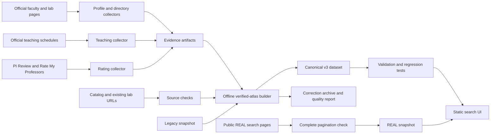

# Architecture

Research Atlas is a static site. Network collection occurs before publication; the browser loads a canonical professor/lab JSON and a separate REAL Portal snapshot. It needs no backend, account, or external API key.

```mermaid
flowchart LR
  A[Official faculty and lab pages] --> B[Profile and directory collectors]
  C[Official teaching schedules] --> D[Teaching collector]
  E[PI Review and Rate My Professors] --> F[Rating collector]
  B --> G[Evidence artifacts]
  D --> G
  F --> G
  H[Catalog and existing lab URLs] --> I[Source checks]
  G --> J[Offline verified-atlas builder]
  I --> J
  K[Legacy snapshot] --> J
  J --> L[Canonical v3 dataset]
  J --> M[Correction archive and quality report]
  L --> N[Validation and regression tests]
  O[Public REAL search pages] --> P[Complete pagination check]
  P --> Q[REAL snapshot]
  N --> R[Static search UI]
  Q --> R
```

## Separate discovery, evidence, and display

Collectors write independent evidence artifacts. Unmatched course assignments and ambiguous rating identities stay in those artifacts. The builder attaches supported fields by stable professor ID, preserving source timestamps. It only consolidates a catalog record into a personal record when normalized full name and department agree; alias IDs are retained. The frontend no longer collapses unrelated people merely because a department mailbox is shared.

`fieldEvidence[field]` is an array of `{sourceUrl, observedAt, evidence, method}`. New claims require supporting text and a valid source URL. Retrieval success and source content dates are different. `verification.fieldsVerified` lists only fields with evidence, and `source_checked` means partial evidence is available. Legacy dates are not reset.

Professor-to-lab links are many-to-many. `labAffiliations` preserves all captured relationships. A generic “Lab Website” link supports an association; a PI claim needs explicit person/leadership evidence. Personal research websites are not automatically laboratory records. Research topic tags come from exact phrases in a sourced research paragraph, not raw HTML, navigation, URL strings, or a department name.

## Source-specific readers

- `refresh_labs.py`: excludes navigation/footer/sidebar material, verifies profile identity, parses local directory rows/cards, follows an optional single personal-site hop, respects robots and crawl delays, and supports bounded resumable caches.
- `refresh_faculty_directories.py`: supplements current departmental rosters, profile links, roles, and cross-department affiliations.
- `refresh_teaching.py`: uses explicit department adapters for HTML tables, published CSVs, official public data, and PDF schedules. Catalogs may supply titles only after an instructor assignment is separately evidenced. Partial names require review.
- `refresh_ratings.py`: reads ordinary public HTML, matches names and UCSD identity, keeps both platforms separate, preserves review counts, and distinguishes no reviews from failed/unmatched searches.
- `refresh_source_checks.py`: audits old lab URL reachability and retrieves catalog rows without treating catalog retrieval as proof of current employment.
- `refresh_real_portal.py`: uses only the public page's read-only card-search operation. It refuses to replace the previous snapshot unless every advertised unique record is collected with consistent pagination totals.

## Merge and audit

`rebuild_verified_atlas.py` is an offline transform with explicit inputs. Initial cleanup archives unsupported legacy values, generic support emails, false Scholar URLs, and directory-derived lab assignments. Removed personal-site pseudo-labs and duplicate catalog records remain in the review archive.

Coverage reports separate populated fields from fields with fresh evidence, and count course source rows separately from unique professor/course/term assignments. Ratings are source-reported subjective aggregates. Absent, ambiguous, unsearched, inaccessible, and zero-review identities are distinct states; no missing score is replaced with numeric zero.

The strict validator checks URLs, evidence integrity, dates, unique IDs, rating ranges/sample sizes, recruiting evidence, and teaching provenance. Tests cover navigation pollution, wrong-person matches, shared emails, duplicate catalog records, table column alignment, malformed URLs, and REAL detail-field extraction.

## Refresh and deployment

The update workflow replaces the old legacy-crawler pipeline, retains public-page caches, budgets UCSD Profiles' crawl delay, refreshes the serving data, and checks for unexplained record loss before committing. Failed source reads remain visible. The existing GitHub Pages workflow serves the static files after push; local edits do not publish by themselves.
